# GPA-MN.org Site Map Analysis

**Website:** https://gpa-mn.org
**Organization:** Greyhound Pets of America - Minnesota
**Analysis Date:** January 26, 2026

---

## Site Structure Overview

### Main Navigation

| Section | URL | Subpages |
|---------|-----|----------|
| Home | `/` | - |
| Adopt | `/adopt` | 5 subpages |
| Donate | `/donate` | - |
| Volunteer | `/volunteer` | - |
| Foster | `/foster` | 2 subpages |
| Events | `/events` | 6 subpages |
| Shop | `/merchandise` | - |
| Supporters | `/partners` | - |
| About | `/resources` | 3 subpages |
| Lost Hound | `/lost-hound` | 2 subpages |
| Plant Sale | `/plant-sale` | - |

---

## Detailed Page Structure

### Adopt Section (`/adopt`)
- `/adopt/available_hounds` - Available Hounds
- `/adopt/our-process` - Our Process
  - `/adopt/our-process/grey-match` - The "Match"
  - `/adopt/our-process/conditions-ownership` - Conditions of Ownership
- `/adopt/greyhound-right-you` - Is a Greyhound Right for You?
- `/adopt/pay-adoption-fee-online` - Pay Adoption Fee Online
- `/adopt/post-adoption-resources` - Post Adoption Resources
- `/adopt/adoption-application` - Adoption Application (form)

### Foster Section (`/foster`)
- `/foster/foster-application` - Foster Application
- `/foster/foster-hound-profile` - Foster Hound Profile Form

### Events Section (`/events`)
- `/events/calendar` - Calendar
- `/events/meet-greets` - Meet & Greets
- `/events/racetoraise` - Race to Raise
- `/events/greyfest` - Greyfest
- `/events/member-appreciation` - Member Appreciation
- `/events/sunday-como-walk` - Sunday Como Walk

### About Section (`/resources`)
- `/resources/who-we-are` - Who We Are
- `/resources/contact` - Contact
- `/resources/participating-vets` - Participating Vets

### Lost Hound Section (`/lost-hound`)
- `/lost-hound/lost-hound` - Lost Hound Information
- `/lost-hound/lost-hound-form` - Lost Hound Form

---

## PDF Documents Found

| Document | Location | URL |
|----------|----------|-----|
| New Hound Owner's Manual | Post Adoption Resources | `/download_file/view/227/245` |
| Heartworm Prescription Note | Post Adoption Resources | `/download_file/view/226/245` |
| Tips for Preventing a Greyhound from Getting Loose | Post Adoption Resources | `/download_file/view/229/245` |
| Stay Connected | Post Adoption Resources | `/download_file/view/228/245` |
| Foster Parents - Reminders and Tips | Foster | `/download_file/205/180` |
| Foster Vetting Checklist | Foster | `/download_file/224/180` |
| Race to Raise Donation Form | Race to Raise | `/download_file/215/184` |
| Greyfest Activities Schedule | Greyfest | `/download_file/view/225/185` |
| Editable Lost Dog Flyer | Lost Hound Info | `/download_file/view/65/213` |

---

## External Links

### Social Media
- TikTok: https://www.tiktok.com/@gpa.minnesota
- Instagram: https://www.instagram.com/gpaminnesota/
- Facebook: https://www.facebook.com/gpamn/
- Twitter: https://twitter.com/gpamn

### Donation Platforms
- Stock Donator: https://stockdonator.com/stock-information/?oid=ccf471ff
- Chewy Wish List: https://www.chewy.com/g/greyhound-pets-of-america-mn_b117009118

### Merchandise
- Threadless Shop: https://gpamn.threadless.com/

### Partner Organizations
- Greyhound Pets of America National: https://greyhoundpets.org
- Northern Lights Greyhound Adoption: http://www.nlgamn.org/
- Minnesota Greyhound Rescue: http://minnesotagreyhoundrescue.org/

### Lost Pet Resources
- Lost Dogs Minnesota Facebook: https://www.facebook.com/LDoMN/
- Pet ID Poster: http://www.petid.com/missing_pet.lasso
- Animal Humane Society: https://www.animalhumanesociety.org/search/lost-pets
- Petfinder: https://www.petfinder.com/dogs/lost-and-found-dogs/
- Craigslist Lost & Found: https://minneapolis.craigslist.org/search/laf
- The Retrievers: https://theretrievers.org/
- FindToto: http://www.findtoto.com/
- FidoFinder: http://www.fidofinder.com/
- PetRescue: http://www.petrescue.com/

### Participating Veterinary Clinics
- Blaine Area Pet Hospital: https://www.blainepethospital.com/
- Brookdale Animal Hospital: https://brookdaleanimalhospital-pa.com/
- Chanhassen Veterinary Clinic: https://vcahospitals.com/chanhassen
- Cottage Grove Animal Hospital: http://www.cottagegroveanimalhospital.com/
- Croix Valley Vet Hospital: http://croixvalleyvet.com/
- Foley Boulevard Animal Hospital: https://foleyblvdanimalhospital.com/
- Happy Tails Animal Hospital: https://www.happytailssuperior.com/
- Superior Animal Hospital & Boarding: https://www.superioranimalhospital.com/
- Twin Cities Animal Rehab Clinic: http://www.tcrehab.com/
- Waconia Veterinary Clinic: https://www.waconiavet.com/

### Sponsors/Partners
- Virtue Fundraising: http://virtuefundraising.com
- BlackStack Brewing: https://www.blackstackbrewing.com/
- Uline: https://www.uline.com/
- Tangerine House of Design: http://www.tangerinehouseofdesign.com

### Other External Links
- Coat Pattern Guide (Archive.org): http://web.archive.org/web/20070204074307/http://www.bark.addr.com/pat/hood/hoodpat.html
- Foster Vetting Update (Google Form): https://forms.gle/cwZKbJgDnox5unHM7
- Greyfest Volunteer Sign-up: https://www.timetosignup.com/gpamn/sheet/1372122
- MN Greyhound Community Facebook: https://www.facebook.com/groups/2222531354712728

---

## Potential Issues Found

| Issue | Page | Description |
|-------|------|-------------|
| Placeholder Link | Plant Sale | "Order plants here" links to homepage - states "link provided this spring" |
| Archived External Link | Volunteer | Coat pattern link points to Archive.org (2007 snapshot) |

---

## Contact Information

- **Phone:** 763-785-4000
- **General Email:** info@gpa-mn.org
- **Fostering:** fostering@gpa-mn.org
- **Meet & Greets:** meetandgreet@gpa-mn.org
- **Events:** events@gpa-mn.org
- **Treasurer:** treasurer@gpa-mn.org
- **President:** president@gpa-mn.org
- **Lost Hound:** losthound@gpa-mn.org
- **Volunteer:** volunteer@gpa-mn.org

---

## Tree View

```
gpa-mn.org
│
├── Home (/)
│
├── Adopt (/adopt)
│   ├── Available Hounds (/adopt/available_hounds)
│   ├── Our Process (/adopt/our-process)
│   │   ├── The "Match" (/adopt/our-process/grey-match)
│   │   └── Conditions of Ownership (/adopt/our-process/conditions-ownership)
│   ├── Is a Greyhound Right for You? (/adopt/greyhound-right-you)
│   ├── Pay Adoption Fee Online (/adopt/pay-adoption-fee-online)
│   ├── Post Adoption Resources (/adopt/post-adoption-resources)
│   │   ├── [PDF] New Hound Owner's Manual
│   │   ├── [PDF] Heartworm Prescription Note
│   │   ├── [PDF] Tips for Preventing Loose Dogs
│   │   └── [PDF] Stay Connected
│   └── Adoption Application (/adopt/adoption-application)
│
├── Donate (/donate)
│   ├── [EXT] Stock Donator
│   └── [EXT] Chewy Wish List
│
├── Volunteer (/volunteer)
│   └── [EXT] Coat Pattern Guide (Archive.org 2007)
│
├── Foster (/foster)
│   ├── Foster Application (/foster/foster-application)
│   ├── Foster Hound Profile (/foster/foster-hound-profile)
│   ├── [PDF] Foster Parents - Reminders and Tips
│   ├── [PDF] Foster Vetting Checklist
│   └── [FORM] Vetting Update (Google Form)
│
├── Events (/events)
│   ├── Calendar (/events/calendar)
│   ├── Meet & Greets (/events/meet-greets)
│   ├── Race to Raise (/events/racetoraise)
│   │   └── [PDF] Donation Form
│   ├── Greyfest (/events/greyfest)
│   │   ├── [PDF] Activities Schedule
│   │   └── [FORM] Volunteer Sign-up (TimeToSignUp)
│   ├── Member Appreciation (/events/member-appreciation)
│   └── Sunday Como Walk (/events/sunday-como-walk)
│
├── Shop (/merchandise)
│   └── [EXT] Threadless Store
│
├── Supporters (/partners)
│   ├── [EXT] Virtue Fundraising
│   ├── [EXT] BlackStack Brewing
│   ├── [EXT] Uline
│   └── [EXT] Tangerine House of Design
│
├── About (/resources)
│   ├── Who We Are (/resources/who-we-are)
│   │   └── [EXT] Greyhound Pets of America National
│   ├── Contact (/resources/contact)
│   └── Participating Vets (/resources/participating-vets)
│       ├── [EXT] Blaine Area Pet Hospital
│       ├── [EXT] Brookdale Animal Hospital
│       ├── [EXT] Chanhassen Veterinary Clinic
│       ├── [EXT] Cottage Grove Animal Hospital
│       ├── [EXT] Croix Valley Vet Hospital
│       ├── [EXT] Foley Boulevard Animal Hospital
│       ├── [EXT] Happy Tails Animal Hospital
│       ├── [EXT] Superior Animal Hospital
│       ├── [EXT] Twin Cities Animal Rehab
│       └── [EXT] Waconia Veterinary Clinic
│
├── Lost Hound (/lost-hound)
│   ├── Lost Hound Information (/lost-hound/lost-hound)
│   │   ├── [PDF] Editable Lost Dog Flyer (Word)
│   │   ├── [EXT] Lost Dogs Minnesota (Facebook)
│   │   ├── [EXT] Pet ID Poster
│   │   ├── [EXT] Northern Lights Greyhound Adoption
│   │   ├── [EXT] Minnesota Greyhound Rescue
│   │   ├── [EXT] Animal Humane Society
│   │   ├── [EXT] Petfinder
│   │   ├── [EXT] Craigslist Lost & Found
│   │   ├── [EXT] The Retrievers
│   │   ├── [EXT] FindToto
│   │   ├── [EXT] FidoFinder
│   │   └── [EXT] PetRescue
│   └── Lost Hound Form (/lost-hound/lost-hound-form)
│
├── Plant Sale (/plant-sale)
│   └── [⚠️ PLACEHOLDER] Order Link (not yet active)
│
└── Social Media (all pages)
    ├── [EXT] TikTok (@gpa.minnesota)
    ├── [EXT] Instagram (@gpaminnesota)
    ├── [EXT] Facebook (@gpamn)
    └── [EXT] Twitter (@gpamn)
```

### Tree Legend

| Tag | Meaning |
|-----|---------|
| `[PDF]` | PDF document download |
| `[EXT]` | External website link |
| `[FORM]` | External form (Google Forms, etc.) |
| `[⚠️ PLACEHOLDER]` | Inactive/placeholder link |

---

## Mermaid Diagram

```mermaid
flowchart TD
    HOME[("🏠 gpa-mn.org")]

    %% Main Navigation
    HOME --> ADOPT[Adopt]
    HOME --> DONATE[Donate]
    HOME --> VOLUNTEER[Volunteer]
    HOME --> FOSTER[Foster]
    HOME --> EVENTS[Events]
    HOME --> SHOP[Shop]
    HOME --> SUPPORTERS[Supporters]
    HOME --> ABOUT[About]
    HOME --> LOSTHOUND[Lost Hound]
    HOME --> PLANTSALE[Plant Sale]

    %% Adopt Section
    ADOPT --> AVAILABLE[Available Hounds]
    ADOPT --> PROCESS[Our Process]
    ADOPT --> RIGHTFORYOU[Is a Greyhound Right for You?]
    ADOPT --> PAYFEE[Pay Adoption Fee Online]
    ADOPT --> POSTADOPT[Post Adoption Resources]
    ADOPT --> ADOPTAPP[Adoption Application]

    PROCESS --> MATCH[The Match]
    PROCESS --> CONDITIONS[Conditions of Ownership]

    POSTADOPT --> PDF1[📄 New Hound Owner's Manual]
    POSTADOPT --> PDF2[📄 Heartworm Prescription Note]
    POSTADOPT --> PDF3[📄 Tips for Preventing Loose Dogs]
    POSTADOPT --> PDF4[📄 Stay Connected]

    %% Foster Section
    FOSTER --> FOSTERAPP[Foster Application]
    FOSTER --> FOSTERPROFILE[Foster Hound Profile]
    FOSTER --> PDF5[📄 Foster Reminders & Tips]
    FOSTER --> PDF6[📄 Foster Vetting Checklist]
    FOSTER --> GFORM1[📝 Vetting Update Form]

    %% Events Section
    EVENTS --> CALENDAR[Calendar]
    EVENTS --> MEETGREET[Meet & Greets]
    EVENTS --> RACE[Race to Raise]
    EVENTS --> GREYFEST[Greyfest]
    EVENTS --> MEMBERAPP[Member Appreciation]
    EVENTS --> COMO[Sunday Como Walk]

    RACE --> PDF7[📄 Donation Form]
    GREYFEST --> PDF8[📄 Activities Schedule]
    GREYFEST --> SIGNUP1[📝 Volunteer Sign-up]

    %% About Section
    ABOUT --> WHOWEARE[Who We Are]
    ABOUT --> CONTACT[Contact]
    ABOUT --> VETS[Participating Vets]

    VETS --> VET1[🏥 Blaine Area Pet Hospital]
    VETS --> VET2[🏥 Brookdale Animal Hospital]
    VETS --> VET3[🏥 + 8 more clinics...]

    %% Lost Hound Section
    LOSTHOUND --> LOSTINFO[Lost Hound Information]
    LOSTHOUND --> LOSTFORM[Lost Hound Form]

    LOSTINFO --> PDF9[📄 Editable Lost Dog Flyer]
    LOSTINFO --> EXT1[🔗 Lost Dogs MN Facebook]
    LOSTINFO --> EXT2[🔗 Pet ID Poster]
    LOSTINFO --> EXT3[🔗 Animal Humane Society]
    LOSTINFO --> EXT4[🔗 + 6 more resources...]

    %% Donate Links
    DONATE --> STOCK[🔗 Stock Donator]
    DONATE --> CHEWY[🔗 Chewy Wish List]

    %% Shop Links
    SHOP --> THREADLESS[🔗 Threadless Store]

    %% Supporters Links
    SUPPORTERS --> SPONSOR1[🔗 Virtue Fundraising]
    SUPPORTERS --> SPONSOR2[🔗 BlackStack Brewing]
    SUPPORTERS --> SPONSOR3[🔗 Uline]
    SUPPORTERS --> SPONSOR4[🔗 Tangerine House of Design]

    %% Plant Sale Issue
    PLANTSALE --> PLACEHOLDER[⚠️ Order Link - Placeholder]

    %% Volunteer External
    VOLUNTEER --> ARCHIVE[🔗 Coat Pattern Guide - Archive.org]

    %% Social Media from all pages
    HOME --> SOCIAL[Social Media]
    SOCIAL --> TIKTOK[🔗 TikTok]
    SOCIAL --> INSTA[🔗 Instagram]
    SOCIAL --> FB[🔗 Facebook]
    SOCIAL --> TWITTER[🔗 Twitter]

    %% Styling
    classDef pdf fill:#ff9999,stroke:#333
    classDef external fill:#99ccff,stroke:#333
    classDef form fill:#99ff99,stroke:#333
    classDef warning fill:#ffcc00,stroke:#333

    class PDF1,PDF2,PDF3,PDF4,PDF5,PDF6,PDF7,PDF8,PDF9 pdf
    class STOCK,CHEWY,THREADLESS,SPONSOR1,SPONSOR2,SPONSOR3,SPONSOR4,EXT1,EXT2,EXT3,EXT4,VET1,VET2,VET3,TIKTOK,INSTA,FB,TWITTER,ARCHIVE external
    class GFORM1,SIGNUP1 form
    class PLACEHOLDER warning
```



---

## Legend

| Symbol | Meaning |
|--------|---------|
| 📄 | PDF Document |
| 📝 | External Form (Google Forms, etc.) |
| 🔗 | External Link |
| 🏥 | Veterinary Clinic |
| ⚠️ | Potential Issue |
